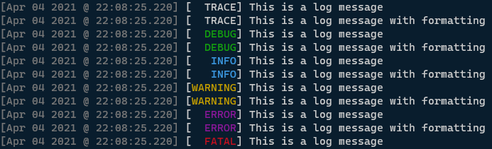
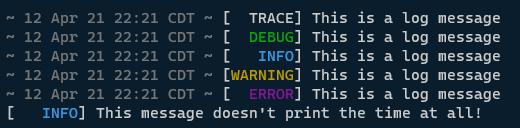
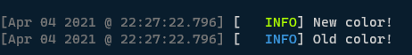
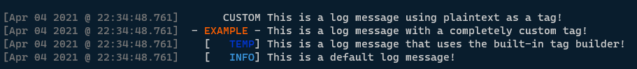
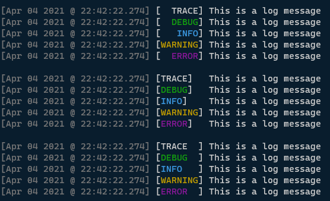
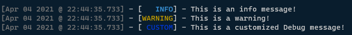
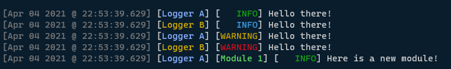

tinylog
---

#### A lightweight and customizable Golang logger

## Features
- Tiny (just 244 functional* lines of code!)
- No third-party imports
- Easily customizable
- Beginner friendly
- Ready to go out-of-the-box
- Custom colors
- Custom log level names
- Simultaneous writing to log files and stdout
- And more!

## Usage
Simply import the library and get straight to logging:

```go
package main

import (
	tlog "github.com/ubergeek77/tinylog"
)

func main() {
	log := tlog.DefaultLogger()

	log.Trace("This is a log message")
	log.Tracef("This is a log message %s", "with formatting")

	log.Debug("This is a log message")
	log.Debugf("This is a log message %s", "with formatting")

	log.Info("This is a log message")
	log.Infof("This is a log message %s", "with formatting")

	// (You may also use Warn() and Warnf())
	log.Warning("This is a log message")
	log.Warningf("This is a log message %s", "with formatting")

	log.Error("This is a log message")
	log.Errorf("This is a log message %s", "with formatting")

	// Fatal messages will call os.Exit(1)
	log.Fatal("This is a log message")
	log.Fatalf("This is a log message %s", "with formatting")

	// Panic messages will call panic(msg)
	// This particular example won't reach this part as the application will exit on the first Fatal call
	log.Panic("This is a log message")
	log.Panicf("This is a log message %s", "with formatting")
}
```



## Configuration

The full list of the configuration options supported by `tinylog`:

| Option | Type | Default | Description |
|---------|------|---------|-------------|
|`LogToOutput`|`bool`|`true`|Whether or not to log to stdout/stderr|
|`LogToFile`|`bool`|`false`|Whether or not file logging is enabled|
|`DebugFile`|`string`|`""`|If file logging is enabled - The log file to send TRACE and DEBUG messages to|
|`InfoFile`|`string`|`""`|If file logging is enabled - The log file to send INFO and WARNING messages to|
|`ErrorFile`|`string`|`""`|If file logging is enabled - The log file to send ERROR, FATAL, and PANIC messages to|
|`PrintTime`|`bool  `|`true`|Whether or not to print the time|
|`TimePattern`|`string`|`"[Jan 01 2006 @ 15:04:05.000] "`|The [formatting pattern](https://golang.org/src/time/format.go) to format the timestamp with|
|`TimeColor`|`string`|`Color.Gray`|The ANSI escape sequence to use to color the time in the console|
|`PrintLevel`|`bool`|`true`|Whether or not to print the log level|
|`LogLevel`|`int`|`Level.TRACE`|For filtering messages; the minimum allowed log level that should be logged|
|`LevelTextInnerFormat`|`string`|`"%7s"`|The `fmt` string to format the level text badge inside of the [braces]|
|`LevelTextOuterFormat`|`string`|`"%s "`|The `fmt` string to format the level text badge, including [braces]|
|`LevelTextPadding`|`int`|`10`|The number of characters to pad the log levels to (including trailing spaces).|
|`LevelTextLeftJustify`|`bool`|`false`|Whether or not to left-justify the log levels|
|`LogPrefix`|`string`|`""`|The string that will always be printed at the beginning of each line, ***after the time and before the log level***; useful for printing submodules|
|`LogSuffix`|`string`|`"\n"`|The string that will always be printed at the end of each line; useful for newlines|
|`DisableColors`|`bool`|`false`|Whether or not color output should be disabled|
|`TraceColor`|`string`|`Color.White`|The full ANSI color sequence to use for TRACE messages|
|`DebugColor`|`string`|`Color.Green`|The full ANSI color sequence to use for DEBUG messages|
|`InfoColor`|`string`|`Color.Cyan`|The full ANSI color sequence to use for INFO messages|
|`WarningColor`|`string`|`Color.Yellow`|The full ANSI color sequence to use for WARNING messages|
|`ErrorColor`|`string`|`Color.Magenta`|The full ANSI color sequence to use for ERROR messages|
|`FatalColor`|`string`|`Color.Red`|The full ANSI color sequence to use for FATAL messages|
|`PanicColor`|`string`|`Color.Red`|The full ANSI color sequence to use for PANIC messages|
|`ResetColor`|`string`|`Color.Red`|The full ANSI color sequence used to clear coloring; mostly here just to be unset internally when coloring is disabled|
|`LevelText.*`|`string`|(varies)|The object that stores the display text for each of the log levels; can be user-overridden|
|`DebugWriter`|`io.Writer`|`os.Stdout`|The io.Writer to send TRACE and DEBUG messages to|
|`InfoWriter`|`io.Writer`|`os.Stdout`|The io.Writer to send INFO and WARNING messages to|
|`ErrorWriter`|`io.Writer`|`os.Stderr`|The io.Writer to send ERROR, FATAL, and PANIC messages to|

### How to configure `tinylog`

To configure `tinylog`, generate a new config object with `NewConfig()`, change any options as desired, then either:
- Generate a new logger with those settings with `NewLogger()`; or,
- Apply the changes to an existing logger with `ApplyConfig()`:

```go
package main

import tlog "github.com/ubergeek77/tinylog"

func main() {
	// Get a new config object with the default settings
	cfg := tlog.NewConfig()

	// Allow only WARNING messages and higher to be logged
	cfg.LogLevel = tlog.WarningLevel

	// Change the WARNING color to Red
	cfg.WarningColor = tlog.ColorRed

	// Create a new logger with these options
	log := tlog.NewLogger(cfg)

	// This won't be logged
	log.Info("Hello!")

	// But this will be logged
	log.Warning("This is a warning!")

	// You can also use NewConfig() as a way to conveniently grab a default setting
	cfg.WarningColor = tlog.NewConfig().WarningColor

	// To apply changes to a logger you already have, use ApplyConfig():
	log.ApplyConfig(cfg)
}
```

### Logging to files

To log to a file, enable file logging by setting `LogToFile` to `true`, and specifying the file path you want certain log levels to go to:

```go
package main

import tlog "github.com/ubergeek77/tinylog"

func main() {
	// Get a new config object with the default settings
	cfg := tlog.NewConfig()

	// Enable file logging
	cfg.LogToFile = true

	// Send TRACE and DEBUG messages to debug.log
	cfg.DebugFile = "debug.log"

	// Send INFO and WARNING messages to "info.log"
	cfg.InfoFile = "info.log"

	// Send ERROR, FATAL, and PANIC messages to "error.log"
	cfg.ErrorFile = "error.log"

	// Unless you disable colors, full ANSI color sequence will also be sent to the log
	cfg.DisableColors = true

	// Disable printing output and log only to files (this is optional! You can log to output and a file at the same time)
	cfg.LogToOutput = false

	// Create a new logger with these settings
	log := tlog.NewLogger(cfg)

	log.Trace("TRACE")
	log.Debug("DEBUG")
	log.Info("INFO")
	log.Warning("WARNING")
	log.Error("ERROR")
}
```

*Note: You can set all three file paths to the same file, and all log levels will be logged to that single file*

### Changing the time format

You can change the time format by using any [Golang-supported formatting pattern](https://golang.org/src/time/format.go). You may also wrap the patten in any additional formatting you want printed:

```go
package main

import tlog "github.com/ubergeek77/tinylog"

func main() {
	// Get a new config object with the default settings
	cfg := tlog.NewConfig()

	// Specify a custom time pattern, with additional formatting surrounding the time
	cfg.TimePattern = "~ 02 Jan 06 15:04 MST ~ "

	// Create a new logger with these options
	log := tlog.NewLogger(cfg)

	// Test the change
	log.Trace("This is a log message")
	log.Debug("This is a log message")
	log.Info("This is a log message")
	log.Warning("This is a log message")
	log.Error("This is a log message")

	// Disable logging the time
	cfg.PrintTime = false
	log.ApplyConfig(cfg)
	log.Info("This message doesn't print the time at all!")
}
```



### Custom Colors

You can turn any ANSI color code into a custom color by using `NewColor()`. With this function, it is possible to create any ANSI color, even 256-bit ones. The function will then add the necessary `\033` and `m]` around your color code. The below example demonstrates how to change the INFO color to a 256-bit green color:

```go
package main

import tlog "github.com/ubergeek77/tinylog"

func main() {
	// Get a new config object with the default settings
	cfg := tlog.NewConfig()

	// Change the INFO color
	cfg.InfoColor = tlog.NewColor("38;5;154")

	// Create a new logger with these settings
	log := tlog.NewLogger(cfg)

	// Test an info message
	log.Info("New color!")

	// Replace the logger with a default one, restoring the default settings
	log = tlog.DefaultLogger()

	// Test another info message
	log.Info("Old color!")
}
```



### Custom log level strings
You can override or "rename" any of the built-in log levels to contain a custom string of your choosing. You have two options for doing so:

- Use the built in `GenerateLevelText()` function, which is what `tinylog` uses to create the default log texts displayed inside [brackets]
- Supply your own customized string to take the place of a log level, with any string you want

The below example demonstrates both approaches:

```go
package main

import (
	"fmt"
	tlog "github.com/ubergeek77/tinylog"
)

func main() {
	// Get a new config object with the default settings
	cfg := tlog.NewConfig()

	// Replace the TRACE level with a plaintext string
	cfg.LevelText.TRACE = "      CUSTOM "

	// Replace the WARNING level text with a completely customized string
	orange := tlog.NewColor("38;5;202")
	cfg.LevelText.WARNING = fmt.Sprintf(" - %s%s%s - ", orange, "EXAMPLE", tlog.ColorReset)

	// The custom WARNING tag has increased in size, so you may want to increase LevelTextPadding so other tags are properly padded
	cfg.LevelTextPadding = 13

	// Replace the DEBUG level text, keeping `tinylog`'s default built in formatting
	// Remember! GenerateTag() takes in a `Config` object to decide how padding should be handled when generating the tag
	// So, if you want to change the padding, you must do it before using GenerateTag()!
	cfg.LevelText.DEBUG = tlog.GenerateTag("TEMP", tlog.ColorBlue, cfg)

	// Create a new logger with these settings
	log := tlog.NewLogger(cfg)

	// Test the changes
	log.Trace("This is a log message using plaintext as a tag!")
	log.Warning("This is a log message with a completely custom tag!")
	log.Debug("This is a log message that uses the built-in tag builder!")
	log.Info("This is a default log message!")
}
```



*Note: The default value for `LevelTextPadding` is `10`, which is the correct padding length for all the default log levels. If you supply your own log level text that is larger than `"[WARNING] "` (a 10-character string), you may need to increase this value.*

### Loglevel justification

```go
package main

import (
	"fmt"
	tlog "github.com/ubergeek77/tinylog"
)

func main() {
	// Get a new config object with the default settings
	cfg := tlog.NewConfig()

	// Create a new logger with the default settings
	log := tlog.NewLogger(cfg)

	// Test the defaults
	log.Trace("This is a log message")
	log.Debug("This is a log message")
	log.Info("This is a log message")
	log.Warning("This is a log message")
	log.Error("This is a log message")

	// Print a newline for demonstration
	fmt.Println()

	// Clear the inner formatting to demonstrate the justification feature
	cfg.LevelTextInnerFormat = "%s"

	// Set left justification
	cfg.LevelTextLeftJustify = true

	// Apply the changes
	log.ApplyConfig(cfg)

	// Test the change
	log.Trace("This is a log message")
	log.Debug("This is a log message")
	log.Info("This is a log message")
	log.Warning("This is a log message")
	log.Error("This is a log message")

	// Print a newline for demonstration
	fmt.Println()

	// Alternatively, you can justify the text inside of the brackets by using a negative formatting string
	cfg.LevelTextInnerFormat = "%-7s"
	log.ApplyConfig(cfg)

	// Test the change
	log.Trace("This is a log message")
	log.Debug("This is a log message")
	log.Info("This is a log message")
	log.Warning("This is a log message")
	log.Error("This is a log message")
}
```



### Formatting log levels outside brackets

The `LevelTextOuterFormat` setting supplies a formatting string that log levels will be printed with. Changing this formatting string will format the text outside (and including) the [brackets]:

```go
package main

import tlog "github.com/ubergeek77/tinylog"

func main() {
	// Get a new config object with the default settings
	cfg := tlog.NewConfig()

	// Change the formatting string used to format level names outside (and including) the brackets
	cfg.LevelTextOuterFormat = "- %s - "

	// Don't forget to also increase the padding length as the maximum possible size has changed
	cfg.LevelTextPadding = 14

	// This can be combined with inner formatting as well
	cfg.LevelTextInnerFormat = "%7s"

	// And of course, this may still be done with custom log level names
	cfg.LevelText.DEBUG = tlog.GenerateTag("CUSTOM", tlog.ColorBlue, cfg)

	// Create a new logger with these settings
	log := tlog.NewLogger(cfg)

	// Test an info message
	log.Info("This is an info message!")
	log.Warning("This is a warning!")
	log.Debug("This is a customized Debug message!")
}
```



#### A note about formatting

When using the default log level tags, upon calling `NewLogger()` or `ApplyConfig()`, `tinylog` will generate new log level tags using your settings, such as a new color or a different amount of padding.

However, `tinylog` will *not* do this for any given log level if said log level has been customized with a custom string. This prevents your customizations from being overwritten.

### Log prefixes and Instanced Logging

Log prefixes can be a useful way to simulate the "nested" feature found in other logging implementations. Since `tinylog` handles these as pre-generated strings, it requires you to manually rewrite this string yourself whenever it needs to be changed. However, this approach avoids the overhead introduced by "automatic detection" methods.
`tinylog` also supports two different loggers at once with different configurations for each. Simply create two `Logger` objects (and if desired, two `Config` objects).

The below example demonstrates both capabilities of `tinylog`:

```go
package main

import tlog "github.com/ubergeek77/tinylog"

func main() {
	// Get a new config object with the default settings
	configA := tlog.NewConfig()

	// Get another config object with the default settings
	configB := tlog.NewConfig()

	// Set some prefixes on each config so they can be told apart:
	configA.LogPrefix = tlog.GenerateTag("Logger A", tlog.NewColor("38;5;111"), configA)
	configB.LogPrefix = tlog.GenerateTag("Logger B", tlog.NewColor("38;5;178"), configB)

	// Create a logger
	loggerA := tlog.NewLogger(configA)

	// Create a second logger
	loggerB := tlog.NewLogger(configB)

	// Change loggerA's INFO color to Yellow without changing loggerB
	configA.InfoColor = tlog.ColorGreen
	loggerA.ApplyConfig(configA)

	// Change loggerB' WARNING color to Red without changing loggerB
	configB.WarningColor = tlog.ColorRed
	loggerB.ApplyConfig(configB)

	// Print the different log messages to verify the settings are unique
	loggerA.Info("Hello there!")
	loggerB.Info("Hello there!")
	loggerA.Warning("Hello there!")
	loggerB.Warning("Hello there!")

	// You can also append to a log prefix to simulate nested logging:
	configA.LogPrefix += tlog.GenerateTag("Module 1", tlog.NewColor("38;5;77"), configA)
	loggerA.ApplyConfig(configA)
	loggerA.Info("Here is a new module!")
}
```



---

*\*Functional lines of code?*

Counting all lines excluding:
- Comments
- Blank lines
- Lines containing only a } or a )

